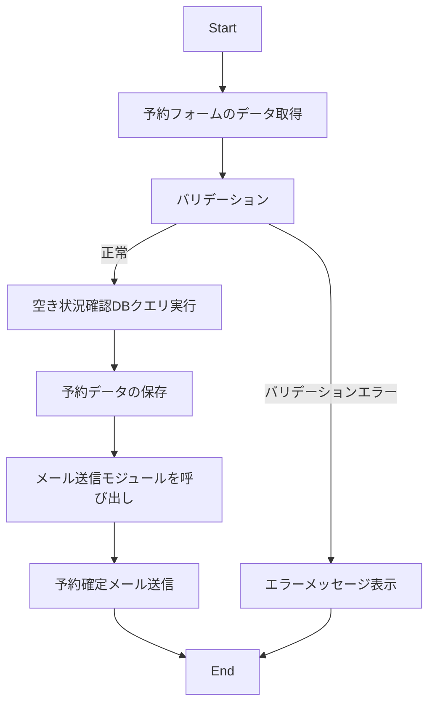

```mermaid
graph TD
    A[Start] --> B[予約フォームのデータ取得]
    B --> C[バリデーション]
    C -- 正常 --> D[空き状況確認DBクエリ実行]
    D --> E[予約データの保存]
    E --> F[メール送信モジュールを呼び出し]
    F --> G[予約確定メール送信]
    G --> H[End]
    C -- バリデーションエラー --> I[エラーメッセージ表示]
    I --> H
```