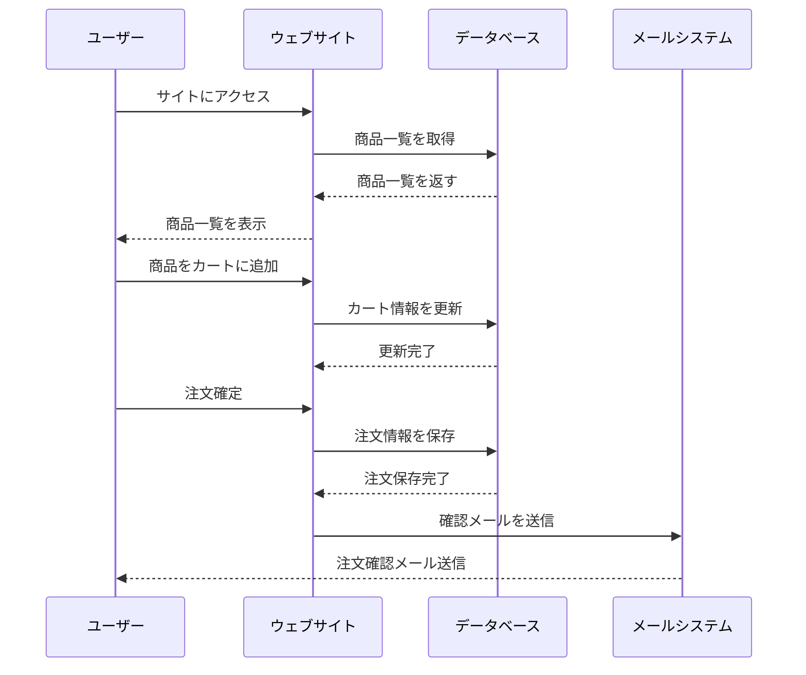

```mermaid
sequenceDiagram
    participant User as ユーザー
    participant Web as ウェブサイト
    participant DB as データベース
    participant Email as メールシステム

    User->>Web: サイトにアクセス
    Web->>DB: 商品一覧を取得
    DB-->>Web: 商品一覧を返す
    Web-->>User: 商品一覧を表示
    User->>Web: 商品をカートに追加
    Web->>DB: カート情報を更新
    DB-->>Web: 更新完了
    User->>Web: 注文確定
    Web->>DB: 注文情報を保存
    DB-->>Web: 注文保存完了
    Web->>Email: 確認メールを送信
    Email-->>User: 注文確認メール送信
```