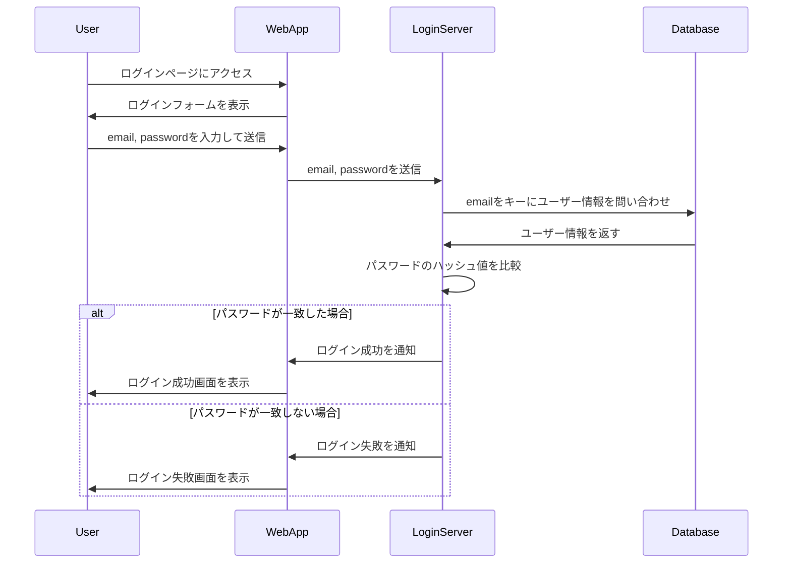

```mermaid
sequenceDiagram
    participant User
    participant WebApp
    participant LoginServer
    participant Database

    User->>WebApp: ログインページにアクセス
    WebApp->>User: ログインフォームを表示
    User->>WebApp: email, passwordを入力して送信
    WebApp->>LoginServer: email, passwordを送信
    LoginServer->>Database: emailをキーにユーザー情報を問い合わせ
    Database->>LoginServer: ユーザー情報を返す
    LoginServer->>LoginServer: パスワードのハッシュ値を比較
    alt パスワードが一致した場合
        LoginServer->>WebApp: ログイン成功を通知
        WebApp->>User: ログイン成功画面を表示
    else パスワードが一致しない場合
        LoginServer->>WebApp: ログイン失敗を通知
        WebApp->>User: ログイン失敗画面を表示
    end
```