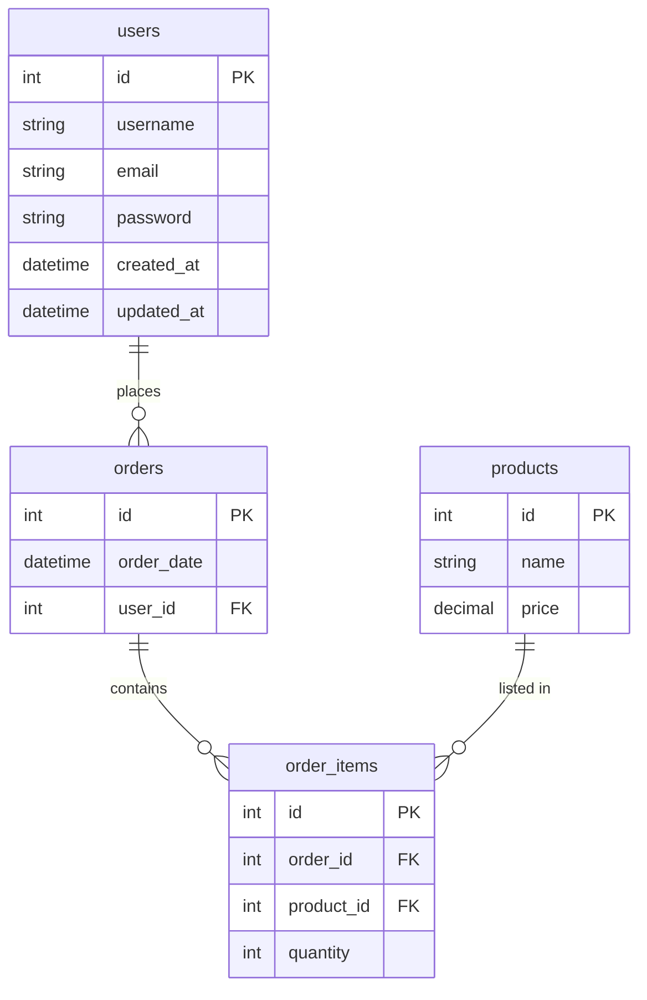

```mermaid
erDiagram
    users {
        int id PK
        string username
        string email
        string password
        datetime created_at
        datetime updated_at
    }
    orders {
        int id PK
        datetime order_date
        int user_id FK
    }
    products {
        int id PK
        string name
        decimal price
    }
    order_items {
        int id PK
        int order_id FK
        int product_id FK
        int quantity
    }
    
    users ||--o{ orders : "places"
    orders ||--o{ order_items : "contains"
    products ||--o{ order_items : "listed in"
```